# 📱 Mini Flutter Projects – Full Collection

> **Bộ 10 mini projects Flutter**  
> Bao gồm: UI, State Management, API, Database, Camera, Notifications, Firebase


---

## 📝 Giới thiệu

Repo này chứa **10 mini project Flutter**, mỗi project tập trung vào một kỹ năng quan trọng:
- 🎨 **UI Layout** - Column, Row, Card, Avatar
- 📦 **State Management** - Provider, ChangeNotifier
- 🌐 **REST API** - HTTP requests, JSON parsing
- 💾 **Local Database** - SQLite persistence
- 📸 **Native Features** - Camera, Permissions
- 🔔 **Notifications** - Local scheduled notifications
- 🔥 **Firebase** - Authentication, Firestore

---

## 📚 Mục lục

- [Giới thiệu](#-giới-thiệu)
- [Cấu trúc dự án](#-cấu-trúc-dự-án)
- [Danh sách 10 projects](#-danh-sách-10-mini-projects)
- [Yêu cầu cài đặt](#-yêu-cầu-cài-đặt)
- [Hướng dẫn chạy](#️-hướng-dẫn-chạy)
- [Screenshots](#-screenshots)
- [Packages sử dụng](#-packages-sử-dụng)

---

## 🗂 Cấu trúc dự án

```
flutter-exercise/
├── lib/
│   ├── main.dart                    # Entry point
│   ├── app_router.dart             # Navigation routes
│   └── projects/
│       ├── p1_profile_card/        # Week 1
│       ├── p2_todo_provider/
│       ├── p3_news_api/
│       ├── p4_chat_ui/
│       ├── p5_note_provider/
│       ├── p6_weather_api/         # Week 2
│       ├── p7_expense_tracker/
│       ├── p8_photo_gallery/
│       ├── p9_reminder_app/
│       └── p10_firebase_auth/
├── assets/
│   └── readme/                     # Screenshots
│       ├── p1.png
│       ├── p2.png
│       └── ...
├── android/
├── ios/
├── pubspec.yaml
└── README.md
```
## 🛠 Yêu cầu cài đặt

### 📋 Prerequisites

- **Flutter SDK** ≥ 3.0 - [Install Flutter](https://flutter.dev/docs/get-started/install)
- **Dart SDK** ≥ 3.0
- **Android Studio** / **Xcode** (for mobile development)
- **VS Code** with Flutter extension (recommended)

### 📦 Packages sử dụng

```yaml
dependencies:
  # UI & Utilities
  url_launcher: ^6.3.0
  shared_preferences: ^2.2.2
  intl: ^0.18.1
  
  # State Management
  provider: ^6.1.2
  
  # Networking
  http: ^1.2.1
  
  # Location & Geocoding
  geolocator: ^10.1.0
  geocoding: ^2.1.0
  
  # Database
  sqflite: ^2.3.0
  path: ^1.8.3
  
  # Charts
  fl_chart: ^0.65.0
  
  # Camera & Gallery
  image_picker: ^1.1.2
  permission_handler: ^11.3.1
  path_provider: ^2.1.2
  
  # Notifications
  flutter_local_notifications: ^17.1.0
  timezone: ^0.9.2
  
  # Firebase
  firebase_core: ^4.2.1
  firebase_auth: ^6.1.2
```

---

## ▶️ Hướng dẫn chạy

### 1️⃣ Clone repository

```bash
git clone https://github.com/hunghung3012/flutter-exercise.git
cd flutter-exercise
```

### 2️⃣ Cài đặt dependencies

```bash
flutter pub get
```

### 3️⃣ Setup Firebase (chỉ cho Project 10)

```bash
# Install FlutterFire CLI
dart pub global activate flutterfire_cli

# Configure Firebase
flutterfire configure
```
---

### 4️⃣ Chạy ứng dụng

```bash
# Kiểm tra devices
flutter devices

# Chạy trên emulator/device
flutter run

# Chạy trên web
flutter run -d chrome

# Build APK (Android)
flutter build apk --release

# Build IPA (iOS)
flutter build ios --release
```
---

## 🧱 Kết quả 10 Projects

### 📅 **Week 1 – Core UI, State & Navigation**

---
### Navigation Screen
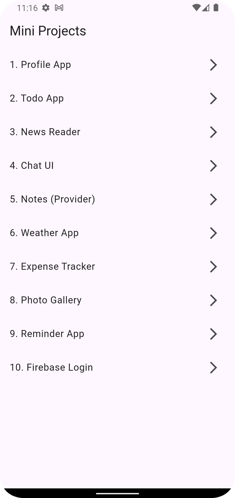

### 1️⃣ Personal Profile App – Basic UI Layout

**🎯 Goal:** Learn basic layout and responsive UI

**📖 Description:**  
Build an app showing your personal info, profile picture, skills, and social links.

**🛠 Technical Requirements:**
- `Column`, `Row`, `ListTile`, `CircleAvatar`, `Card`
- Responsive layout
- Dark mode toggle

**✨ Outcome:**  
A clean, responsive personal portfolio app.

**📷 Screenshots:**  
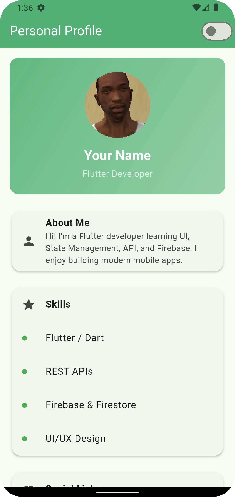
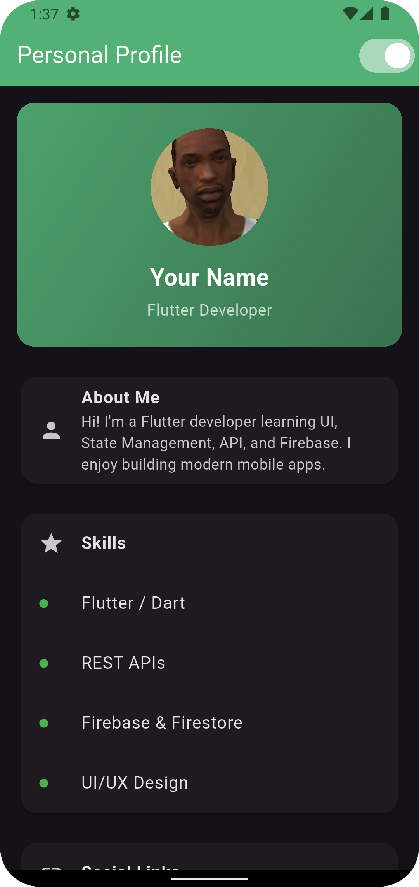

---

### 2️⃣ Todo App – Local State Management

**🎯 Goal:** Manage a simple task list using local state

**📖 Description:**  
Add, complete, and delete tasks with local storage.

**🛠 Technical Requirements:**
- `StatefulWidget`, `ListView.builder()`
- `setState()` for state management
- Persistent storage (optional)

**✨ Outcome:**  
Offline-capable to-do list app.

**📷 Screenshots:**  
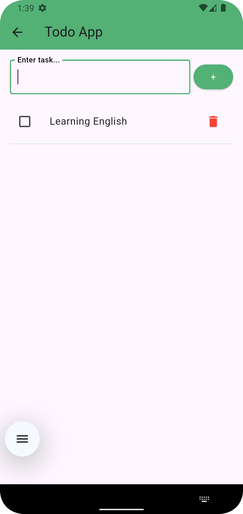
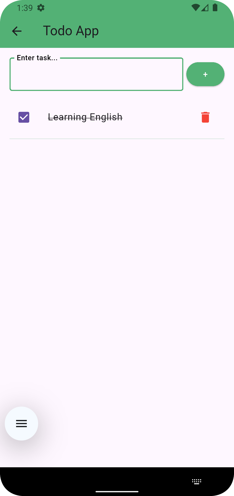

---

### 3️⃣ News Reader App – REST API Integration

**🎯 Goal:** Work with REST APIs

**📖 Description:**  
Fetch news from NewsAPI.org, display articles and open details.

**🛠 Technical Requirements:**
- `http` package, `FutureBuilder`
- JSON parsing
- Error handling and loading indicators

**✨ Outcome:**  
Real-time API-based news reader.

**📷 Screenshots:**  
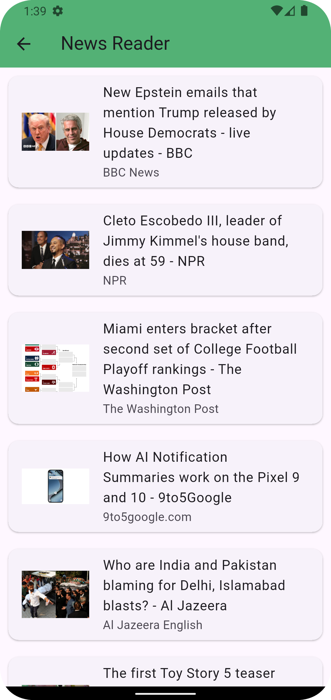


---

### 4️⃣ Chat UI Clone – Complex Layouts

**🎯 Goal:** Create complex layouts with scrolling

**📖 Description:**  
Design a chat UI similar to Messenger or WhatsApp.

**🛠 Technical Requirements:**
- `ListView`, `Row`, `Column`, `Container`
- Dynamic message bubble UI
- Scroll to bottom on new message

**✨ Outcome:**  
Functional mock chat interface.

**📷 Screenshots:**  
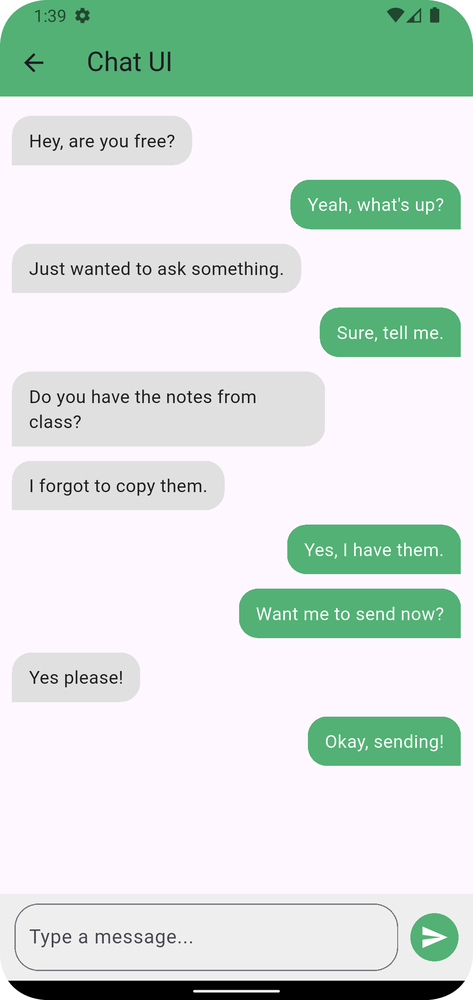

---

### 5️⃣ Notes App – Provider State Management

**🎯 Goal:** Manage app-wide state using Provider

**📖 Description:**  
Create, edit, and delete notes in real-time.

**🛠 Technical Requirements:**
- `Provider`, `ChangeNotifier`
- `TextField`, `FloatingActionButton`
- Real-time UI updates

**✨ Outcome:**  
Responsive notes app with live updates.

**📷 Screenshots:**  
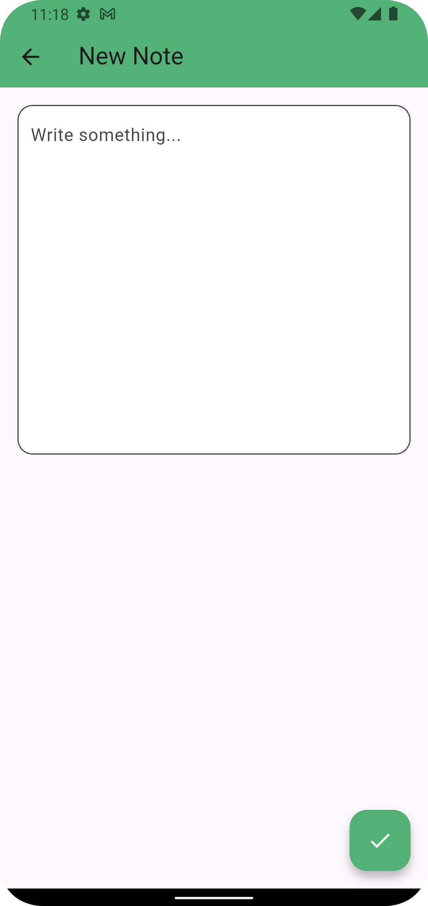
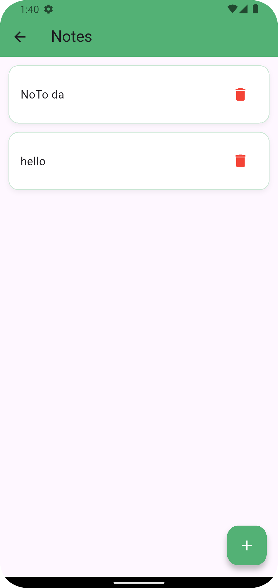

---

### 📅 **Week 2 – Networking, Persistence & Integration**

---

### 6️⃣ Weather App – Geolocation & API

**🎯 Goal:** Fetch and display live weather data

**📖 Description:**  
Show weather based on user's geolocation.

**🛠 Technical Requirements:**
- `geolocator`, `http`
- `FutureBuilder`, JSON parsing
- Permission handling
- Gradient UI

**✨ Outcome:**  
Real-time weather forecast app with beautiful UI.

**📷 Screenshots:**  
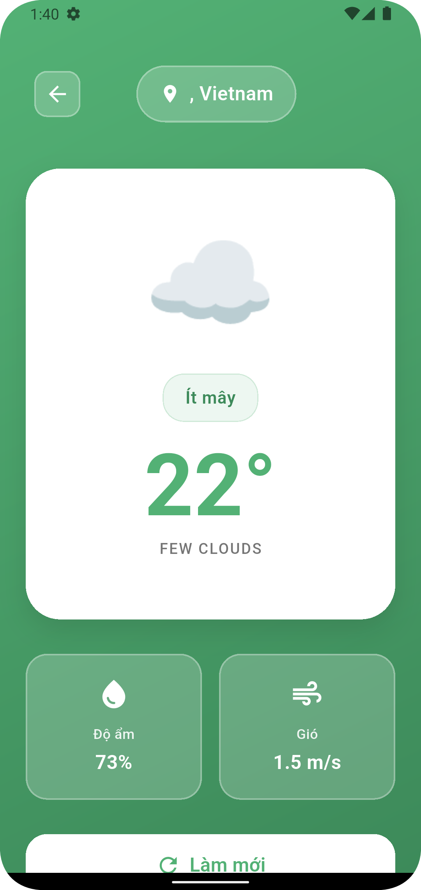

---

### 7️⃣ Expense Tracker – SQLite + Charts

**🎯 Goal:** Save and visualize local data

**📖 Description:**  
Record daily expenses, view summary charts.

**🛠 Technical Requirements:**
- `sqflite`, `path`
- `fl_chart` for pie/bar charts
- CRUD operations
- Monthly statistics

**✨ Outcome:**  
Offline expense manager app with beautiful statistics.

**📷 Screenshots:**  
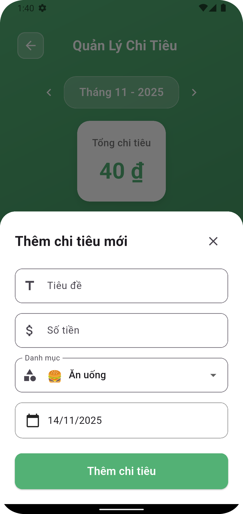
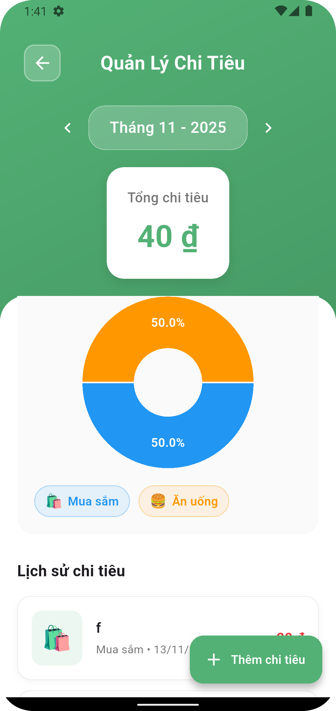

---

### 8️⃣ Photo Gallery App – Camera Integration

**🎯 Goal:** Integrate native device features

**📖 Description:**  
Take pictures and show them in a gallery view.

**🛠 Technical Requirements:**
- `image_picker`, `permission_handler`
- `GridView.builder()`
- Optional: Local storage with `path_provider`

**✨ Outcome:**  
Simple photo gallery app with camera access.

**📷 Screenshots:**  
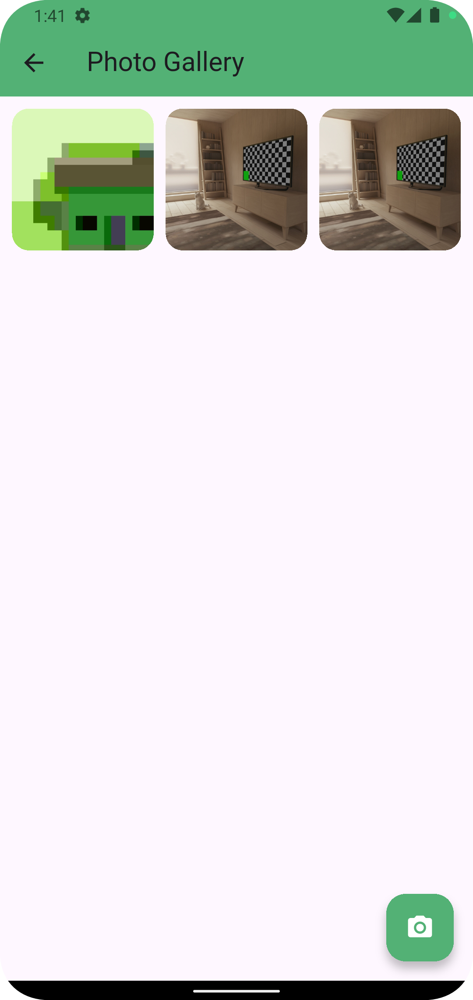

---

### 9️⃣ Reminder App – Local Notifications

**🎯 Goal:** Work with local notifications

**📖 Description:**  
Schedule reminders with custom titles and times.

**🛠 Technical Requirements:**
- `flutter_local_notifications`
- `DateTimePicker`
- Async background trigger
- Notification channels (Android)

**✨ Outcome:**  
Functional reminder app with scheduled notifications.

**📷 Screenshots:**  
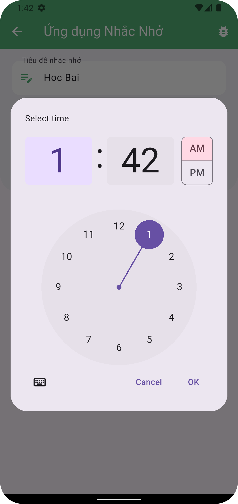
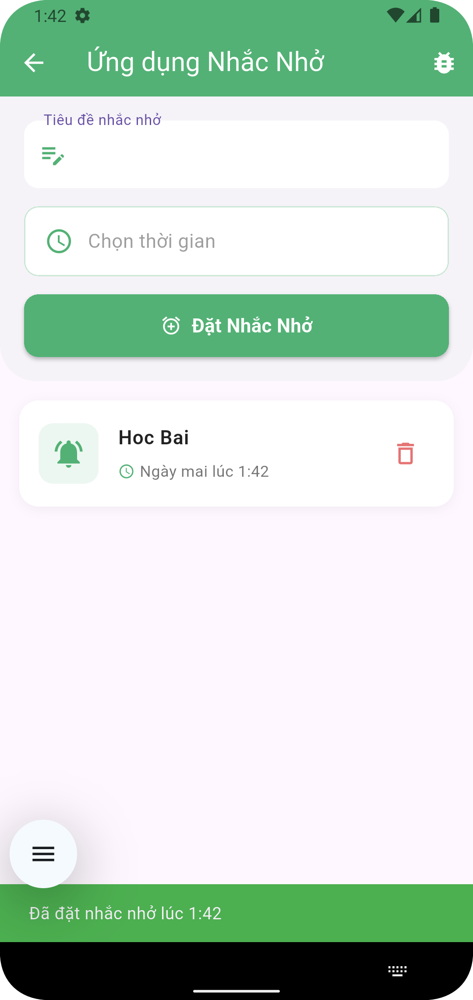

---

### 🔟 Firebase Login App – Authentication

**🎯 Goal:** Integrate Firebase Authentication

**📖 Description:**  
Login/register with email & password and show user info.

**🛠 Technical Requirements:**
- `firebase_core`, `firebase_auth`
- `StreamBuilder` for auth state
- Form validation
- Logout functionality

**✨ Outcome:**  
Firebase-based login app with secure authentication.

**📷 Screenshots:**  


---

## 📱 Platform Support

| Platform | Supported | Notes |
|----------|-----------|-------|
| Android | ✅ | Full support |
| iOS | ✅ | Full support |
| Web | ⚠️ | Limited (no camera/notifications) |
| Windows | ⚠️ | UI only |
| macOS | ⚠️ | UI only |
| Linux | ⚠️ | UI only |

---

## 🖼 Screenshots

### Project 1: Profile App
<p align="center">
  
  
</p>

### Project 2: Todo App
<p align="center">
  
  
</p>

### Project 3: News Reader
<p align="center">
  
  
</p>

### Project 4: Chat UI
<p align="center">
  
</p>

### Project 5: Notes App
<p align="center">
  
</p>

### Project 6: Weather App
<p align="center">
  
</p>

### Project 7: Expense Tracker
<p align="center">
  
  
</p>

### Project 8: Photo Gallery
<p align="center">
  
</p>

### Project 9: Reminder App
<p align="center">
  
  
</p>

### Project 10: Firebase Auth
<p align="center">
  
</p>

---

## 🎯 Learning Path

### 🟢 Beginner (Week 1)
1. **Profile Card** - UI Basics
2. **Todo App** - State Management
3. **News Reader** - API Integration

### 🟡 Intermediate
4. **Chat UI** - Complex Layouts
5. **Notes App** - Provider Pattern
6. **Weather App** - Geolocation + API

### 🔴 Advanced (Week 2)
7. **Expense Tracker** - SQLite + Charts
8. **Photo Gallery** - Native Features
9. **Reminder App** - Background Tasks
10. **Firebase Auth** - Cloud Integration

---

## 🐛 Troubleshooting

### Permission Issues (Android)

Add to `android/app/src/main/AndroidManifest.xml`:

```xml
<uses-permission android:name="android.permission.ACCESS_FINE_LOCATION" />
<uses-permission android:name="android.permission.ACCESS_COARSE_LOCATION" />
<uses-permission android:name="android.permission.INTERNET" />
<uses-permission android:name="android.permission.CAMERA"/>
<uses-permission android:name="android.permission.READ_EXTERNAL_STORAGE"/>
<uses-permission android:name="android.permission.WRITE_EXTERNAL_STORAGE"/>
<uses-permission android:name="android.permission.POST_NOTIFICATIONS"/>
<uses-permission android:name="android.permission.SCHEDULE_EXACT_ALARM"/>
<uses-permission android:name="android.permission.USE_EXACT_ALARM"/>
<uses-permission android:name="android.permission.WAKE_LOCK"/>
<uses-permission android:name="android.permission.RECEIVE_BOOT_COMPLETED"/>
<uses-permission android:name="android.permission.VIBRATE"/>
```

### iOS Permissions

Add to `ios/Runner/Info.plist`:

```xml
<key>NSCameraUsageDescription</key>
<string>Need camera access for taking photos</string>
<key>NSLocationWhenInUseUsageDescription</key>
<string>Need location for weather data</string>
```

### Firebase Setup Issues

```bash
# Reset Firebase config
flutter clean
flutterfire configure --force

# Rebuild
flutter pub get
flutter run
```

---

## 📚 Resources

- [Flutter Documentation](https://docs.flutter.dev/)
- [Dart Language Tour](https://dart.dev/guides/language/language-tour)
- [Provider Package](https://pub.dev/packages/provider)
- [Firebase Flutter](https://firebase.google.com/docs/flutter/setup)

---


## 📄 License

MIT License - Tự do sử dụng cho mục đích học tập và thương mại.

---

## 👨‍💻 Author

**Võ Nhật Hưng**
- GitHub: [@hunghung3012](https://github.com/hunghung3012)
- Email: hungvn.22it@vku.udn.vn

---

## 🙏 Acknowledgments

- [Flutter Team](https://flutter.dev/)
- [Pub.dev Contributors](https://pub.dev/)
- [Firebase Team](https://firebase.google.com/)

---

**⭐ If you find this helpful, please give it a star!**

**📌 Fork this repo to customize for your own learning journey!**